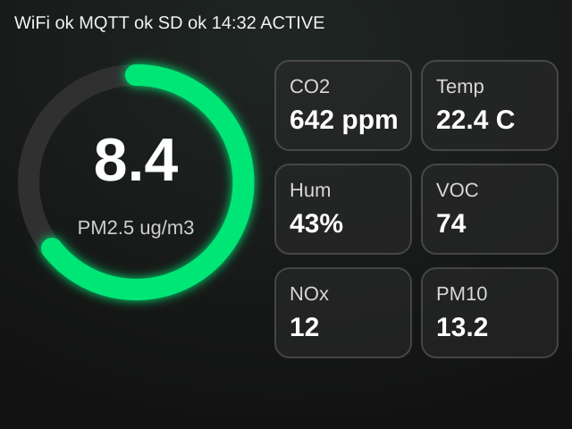
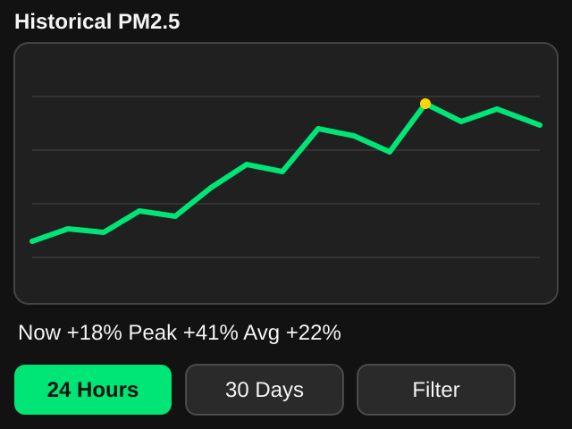
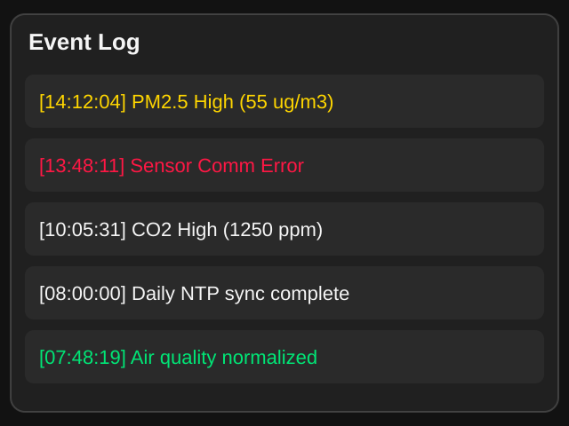
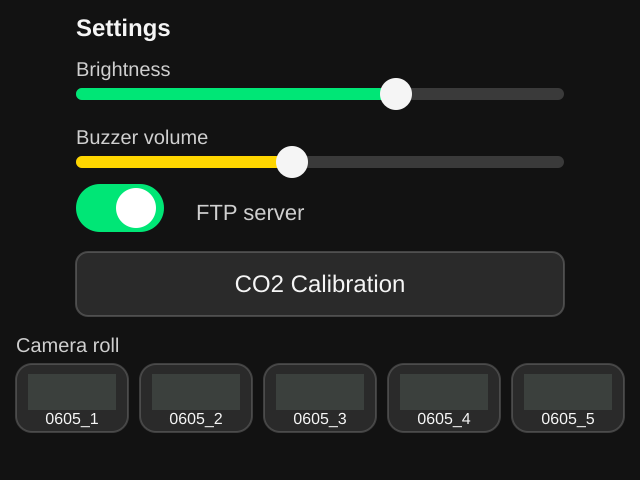

# Premium Air Quality Station Firmware

PlatformIO firmware for an M5Stack CoreS3-Lite with a Sensirion SEN66 on Grove Port A.

## Feature Overview

This firmware turns the CoreS3-Lite into a compact premium air-quality station with live SEN66 readings, long-term CSV logging, alarm handling, camera snapshots, and optional network publishing.

- Measures PM1.0, PM2.5, PM4.0, PM10, CO2, VOC Index, NOx Index, temperature, and relative humidity.
- Uses SEN66 warmup-aware measurement scheduling so low-power cycles do not produce stale startup readings.
- Stores Excel-friendly daily CSV records and hourly monthly summaries for fast chart loading on a microcontroller.
- Presents a dark LVGL interface with glass-style cards, horizontal swipe navigation, alarm banner, and touch controls.
- Publishes MQTT payloads when Wi-Fi is available while continuing local SD logging when offline.
- Plays short walk-up chirps through the CoreS3 I2S speaker using `M5.Speaker`, not PWM buzzer output.
- Captures manual and wake-triggered camera snapshots, stores JPEG files on SD, and rotates the camera folder to the newest 10,000 images.
- Provides optional FTP access to the SD card when enabled in settings.
- Tracks HVAC filter health by learning a particulate baseline and charting long-term PM2.5/PM10 deviation over days.
- Uses configurable alarm hysteresis, default 5%, so alerts do not flap when a reading hovers near the threshold.
- Hosts a built-in web dashboard from the device for phones and desktops, including live readings, charts, camera previews, SD downloads, and `config.json` download/upload.

## UI Mockups

These are documentation-grade mockups generated from the current LVGL layout. They are not hardware screenshots, but they match the 320x240 screen structure, control placement, and visual hierarchy used in `ui_manager.cpp`.

| Dashboard | Historical Charts |
| --- | --- |
|  |  |

| Event Log | Settings and Camera Roll |
| --- | --- |
|  |  |

## Screen Walkthrough

### Screen 1: Dashboard

The dashboard is the default screen after boot. It shows a compact top status bar with Wi-Fi, MQTT, SD, time, and device state. The large circular gauge focuses on PM2.5 as the primary pollutant signal, using the AQI tint color: green for good, amber for warning, and red for unhealthy.

The right side uses six glass cards for CO2, temperature, humidity, VOC, NOx, and PM10. When an alarm condition is active, a red `SILENCE ALARM` banner appears across the bottom. The banner remains visible until air quality returns below the configured clear threshold, which defaults to 5% below the alarm threshold.

The speaker does not beep continuously. It chirps briefly when proximity/touch indicates someone has walked up to the station. A normal walk-up chirp is two soft notes; if an air-quality alert is active, the walk-up chirp becomes a short three-note urgent pattern. A 30-second cooldown prevents repeated chirps while someone remains nearby.

### Screen 2: Historical Charts

The history screen uses `lv_chart` to render downsampled data without loading large files into memory. The `24 Hours` mode reads the current daily binary log and strides it down to roughly 120 display points. The `30 Days` mode reads the precomputed hourly summary file instead of parsing every raw measurement.

Rolling mean, minimum, and maximum values are shown below the chart. This screen is designed to stay responsive even after weeks of logging.

The `Filter` mode changes the chart into a slow-trend filter analysis view. It compares daily trimmed PM2.5/PM10 deviation against the saved baseline and displays current, peak, and average percent increase. This intentionally uses daily trimmed values instead of raw short-term readings so cooking, dusting, vacuuming, and other temporary spikes do not immediately look like a dirty filter.

### Screen 3: Event Log

The event log is a scrollable LVGL list of persisted anomalies and system events. Examples include high PM2.5, high CO2, VOC alarm, sensor communication failure, and recovery messages.

Events are also appended to `/alerts.log` on the SD card, so the visible list is backed by a durable text log for later inspection.

### Screen 4: Settings and Camera Roll

The settings screen exposes brightness, alarm volume, FTP enable/disable, and manual CO2 calibration. Brightness and volume changes are saved back to `/config.json` so they survive restart.

The `Baseline` button starts a new HVAC filter baseline capture. By default, the device learns for 72 hours, then stores a trimmed hourly mean for PM2.5 and PM10. The status line shows whether the baseline is learning, ready, or not set.

The `Snap` button saves a timestamped JPEG into `/cam`. The camera manager keeps up to 10,000 captures and removes the oldest files during rotation.

### Screen 5: Maintenance

The maintenance screen is read-only and intended for field checks. It shows current Wi-Fi connection state, IP address, subnet, gateway, RSSI, configured SSID/password status, MQTT target, timezone, SD card usage, SEN66 online/measuring/warmup state, sample/error counters, last success/error timestamps, and the current alarm thresholds plus hysteresis.

This screen deliberately does not expose editing controls. Configuration changes are still made through `/config.json` on the SD card or through the web dashboard config upload flow.

## HVAC Filter Baseline Logic

This feature is designed to avoid short-term false positives. A dirty HVAC filter is treated as a slow trend, not a single bad reading.

1. Press `Baseline` after installing a clean HVAC filter.
2. The station records normal particulate behavior for `filter_baseline.capture_hours`, defaulting to 72 hours.
3. When the capture window is complete, it reads hourly summary records and calculates trimmed means for PM2.5 and PM10, dropping the highest and lowest 10% of hourly values.
4. The `Filter` chart groups later hourly summaries by day, calculates percent increase over baseline, and trims the highest daily outlier hours before plotting.
5. The chart summary reports current, peak, and average deviation over the recent window.

This makes the analysis resistant to brief events such as cooking, cleaning, candles, open windows, and vacuuming. For even stronger filter-life prediction, feed HVAC fan runtime into MQTT or a future GPIO/current-sense input and combine particulate deviation with fan-hours.

The filter baseline is persisted in `/config.json`:

```json
"timezone": "CST6CDT,M3.2.0,M11.1.0",
"alarm_hysteresis_percent": 5.0,
"filter_baseline": {
  "active": false,
  "ready": true,
  "capture_hours": 72,
  "pm25_ugm3": 7.8,
  "pm10_ugm3": 12.4,
  "sample_hours": 68,
  "warn_percent": 35,
  "replace_percent": 60
}
```

## Device-Hosted Web Dashboard

The firmware includes a web dashboard served directly from the CoreS3. No separate web app, cloud service, or external host is required.

After the device joins Wi-Fi, open one of these from a phone or desktop on the same network:

```text
http://core-air.local/
http://<device-ip>/
```

The dashboard mirrors the on-device visual language: dark background, glass-style cards, AQI tinting, a PM2.5 primary gauge, metric cards, history chart tabs, and camera/log download panels.

Web dashboard features:

- Live PM2.5, PM10, CO2, VOC, NOx, temperature, and humidity.
- Device status: Wi-Fi, MQTT, SD, current firmware state, and IP address.
- MQTT configuration/status card showing host, port, topic, client ID, and live connection state.
- History chart modes: `24 Hours`, `30 Days`, and `Filter`.
- Download browser for `/log` CSV records, `/alerts.log`, and `/cam` JPEG captures.
- Camera-roll thumbnails with full-size JPEG links.
- `config.json` download/upload. Uploaded JSON is validated, written to SD, and the station restarts so new settings take effect.

Local HTTP endpoints:

- `GET /` serves the responsive dashboard.
- `GET /api/live` returns live JSON readings and device status.
- `GET /api/history?mode=day|month|filter&metric=pm25` returns chart points.
- `GET /api/files?dir=/log` lists log files and `alerts.log`.
- `GET /api/files?dir=/cam` lists camera images.
- `GET /download?path=/log/YYYYMMDD.csv` downloads SD files.
- `GET /image?path=/cam/pic_YYYYMMDD_HHMMSS.jpg` streams a JPEG preview.
- `GET /config.json` downloads the active configuration file.
- `POST /config.json` uploads a replacement configuration file and restarts the station after validation.

The web dashboard is intended for trusted LAN use. It currently has no authentication layer, so do not port-forward it directly to the public internet.

## MQTT Configuration

MQTT settings live in a dedicated section of `/config.json`. Leave `host` empty to disable MQTT publishing.

```json
"mqtt": {
  "host": "192.168.4.10",
  "port": 1883,
  "client_id": "m5stack-cores3-air",
  "topic": "air/station"
}
```

Older flat fields such as `mqtt_host`, `mqtt_port`, `mqtt_client_id`, and `mqtt_topic` are still accepted when loading an existing SD card config.

## Build

For a beginner-friendly walkthrough with checks at each step, open [docs/platformio_setup_guide.html](docs/platformio_setup_guide.html).

Install PlatformIO, then run:

```powershell
$env:PYTHONIOENCODING='utf-8'
$env:PYTHONUTF8='1'
pio run
pio run --target upload
pio device monitor
```

The UTF-8 environment variables avoid a known Windows/PlatformIO dependency-tree output issue on CP1252 consoles.

This project builds successfully with PlatformIO Core 6.1.19 against `board = m5stack-cores3`.

## Hardware Notes

- SEN66 I2C: SDA GPIO 2, SCL GPIO 1, address `0x6B`.
- Grove VCC is 5 V; power the Adafruit 6331 input from Grove VCC and let the breakout LDO provide 3.3 V for the SEN66.
- microSD SPI follows the CoreS3 pin map: MISO GPIO 35, MOSI GPIO 37, SCK GPIO 36, CS GPIO 4.
- GC0308 camera uses the current M5Stack CoreS3 RGB565 camera path, then compresses to JPEG before saving.
- The LTR-553 proximity sensor is polled cautiously through M5Unified's shared internal I2C bus and shown on the maintenance screen. Camera snapshots are manual via `Snap` and also attempted when the display wakes from a dimmed state.

## Modules

- `config.*`: SD init, `/config.json`, directory creation.
- `sensor_manager.*`: SEN66 init, warmup, standby, averaged reads, CO2 calibration.
- `logger.*`: Excel-friendly daily CSV records, 48-byte hourly summaries, downsampled history reads, alert log.
- `ui_manager.*`: LVGL dark glass UI, swipe screens, dashboard, chart, event log, settings/camera roll, maintenance diagnostics.
- `audio_manager.*`: M5Unified I2S one-shot walk-up chirps and mute behavior.
- `camera_manager.*`: CoreS3 GC0308 capture, RGB565-to-JPEG save, 10,000-file rotation.
- `ftp_manager.*`: SimpleFTPServer wrapper.
- `web_manager.*`: Device-hosted dashboard, live/history APIs, SD file/image downloads, and config download/upload.
- `main.cpp`: FreeRTOS acquisition/network tasks, alarm state, UI service loop, light-sleep handling.
