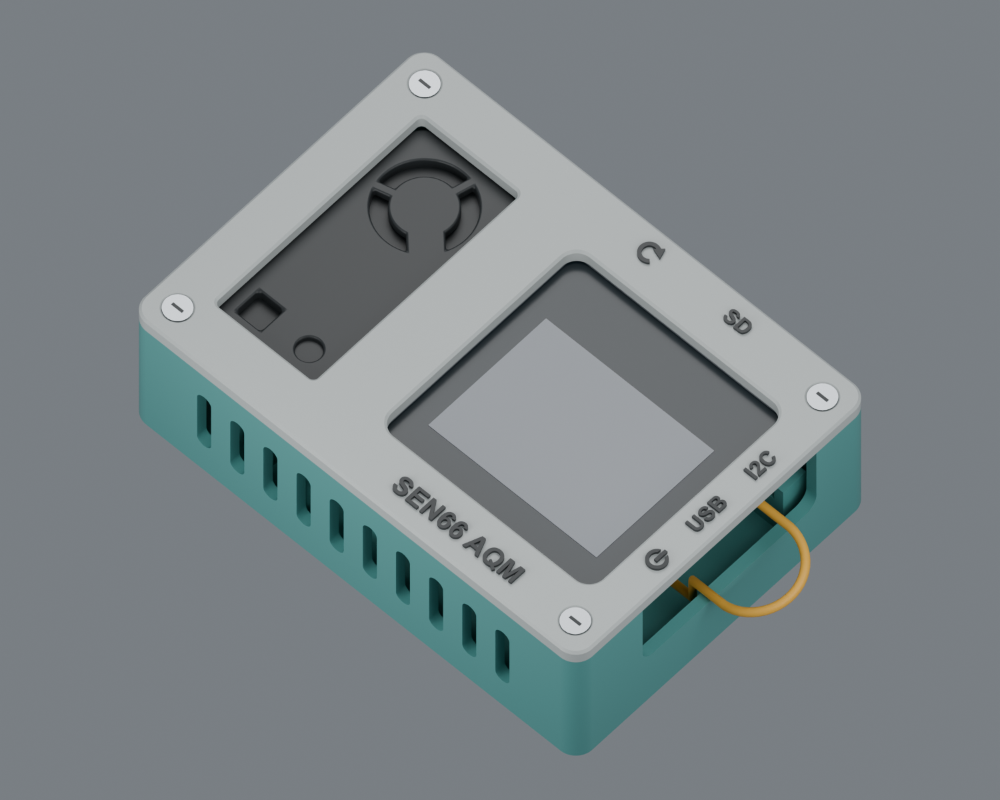
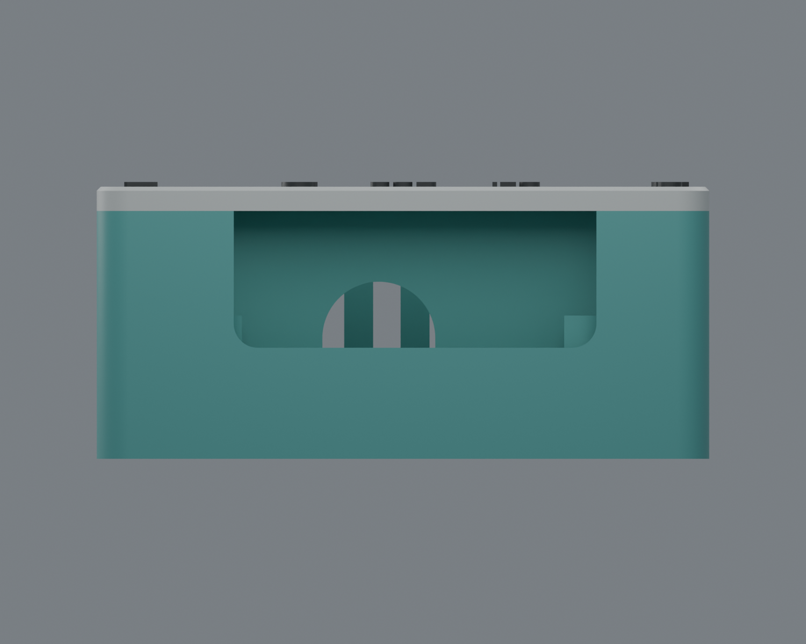
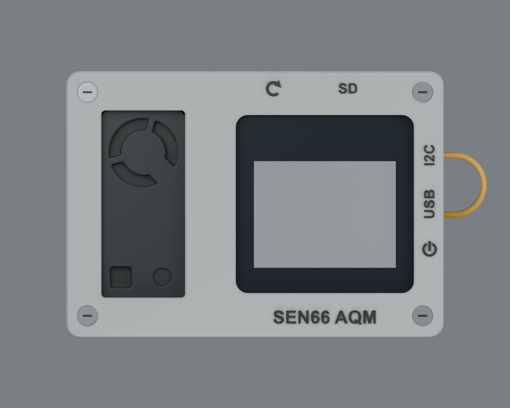
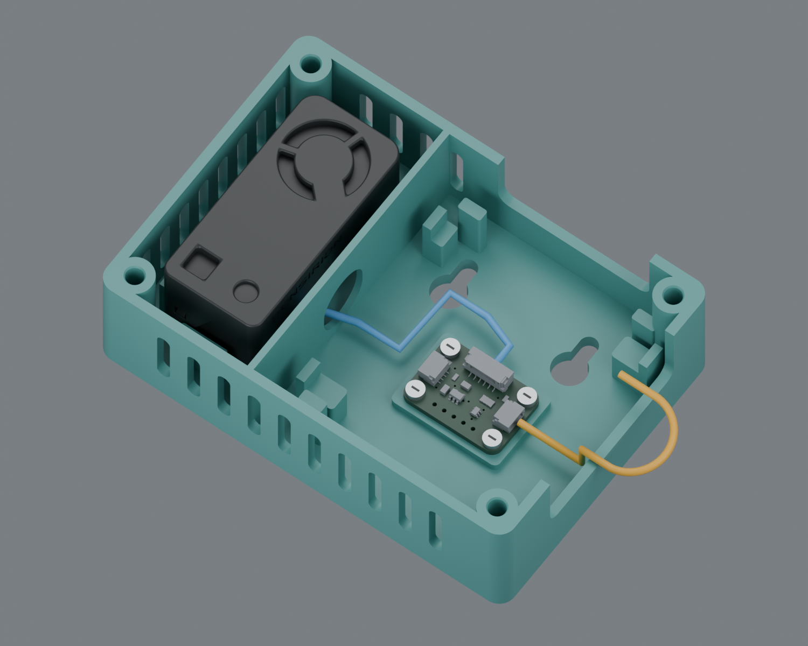
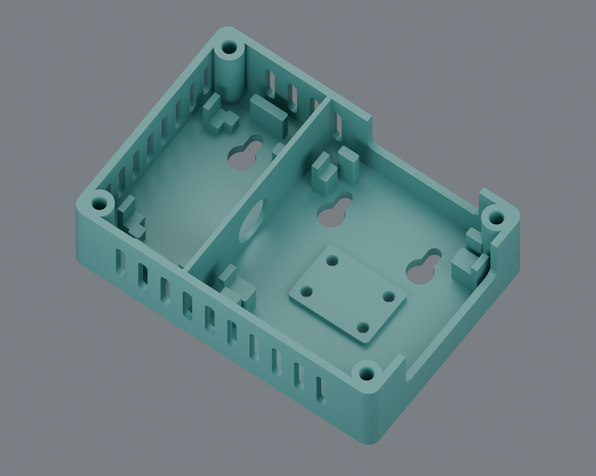
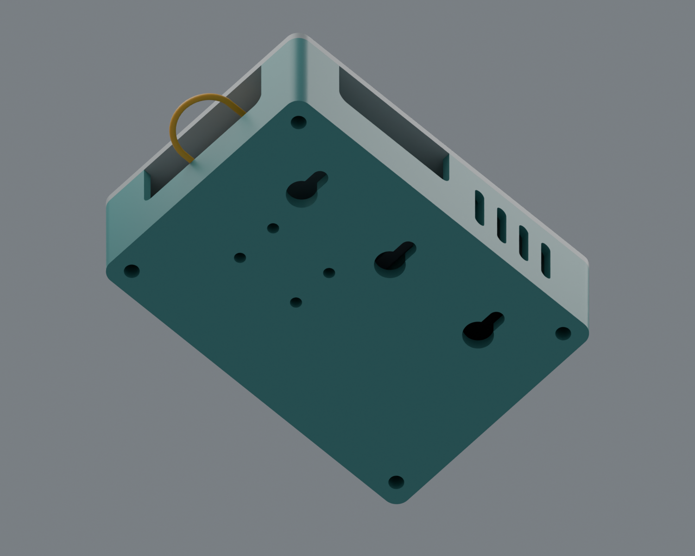

# SEN66 AQM: Compact Enclosure v3.1

**CAD-checked first-fit prototype. Not physically test printed, load tested or
thermally validated.** PLA, supplied CoreS3-SE housing model, SEN66, Adafruit 6331.
Firmware is unchanged. Keep v3 parts together; they do not fit the v2 shell.

This revision is **v3.1**, in the existing `enclosure_v3` directory.
[Download the complete v3.1 ZIP](https://github.com/pjrose/sen66_M5CoreS3/releases/download/enclosure-v3.1/SEN66_AQM_v3_1.zip)
or use the individual files below.
The [previous published v3 ZIP](https://github.com/pjrose/sen66_M5CoreS3/releases/download/enclosure-v3/SEN66_AQM_v3.zip)
predates these refinements; it has not been replaced. The unchanged bezel fits
either v3 shell. Three aligned wall keyholes still allow a middle single screw
or the symmetric outer pair.



## Final Refinements

- All **eight insert pilots pass completely through the rear**: four M3 corner
  bosses and four M2.5 mesa holes. The insert test strips also have through holes.
- Divider moved **0.7 mm toward the SEN66**. All 22 remaining ventilation slots
  have the same unobstructed 3.4 x 16 mm capsule profile; nominal divider/slot
  clearance is 0.2 mm.
- Removed the lone right-side vent and low half-moon I2C notch.
- Main right access opening remains **45 mm wide**, with its bottom at the
  **Core rear plane, Z=13.8 mm**. QT wiring returns through this main opening.
- Both service windows retain 3 mm lower corner radii, but their sides now run
  straight to the faceplate underside. No pointed upper corner returns remain;
  the faceplate stays continuous above the openings.



## Changes From v2

- Both devices share the same horizontal centreline, midway up the faceplate.
- Height reduced from **90 to 76 mm**. Width remains 108 mm. Both device fronts
  remain coplanar; no extra adapter-to-Core clearance was sacrificed.
- All perimeter air slots have semicircular ends, with no pointed roofs.
- SD/reset and USB/Grove/power service windows have **3 mm lower corner radii**.
- Reset arrow rebuilt with an overlapping, tangent arrowhead. Its geometry is
  checked as one solid before it is fused to the faceplate.
- Positive upper/lower stops added for the Core and SEN66. They prevent vertical
  sliding without relying on bezel friction. Existing side guides remain.
- Three high wall keyholes share one horizontal row. The left is on the
  **sensor's width centreline**, 22 mm from the left wall; the right mirrors
  that offset, and the middle is on the enclosure centreline.
- The upper-left Core rear support is narrower and slightly shifted left to
  clear the middle screw. All four Core supports are checked for housing contact.
- Adapter now bolts directly onto a **continuous flat mesa** using four M2.5
  inserts on the board's actual 20.32 x 12.70 mm hole pattern. No finger clamps.
- No mounting feet, hanging slit, rear ventilation slits or cable-tie slits.
  The flat back has three wall keyholes and the eight insert-bore exits.
- Four aligned countersunk M3 faceplate screws and embossed labels retained.

## Dimensions

| Feature | Nominal dimension |
| --- | --- |
| Outer width x height | 108 x 76 mm |
| Flat wall/rear to bezel face | 33.8 mm |
| Depth including raised lettering | 34.4 mm |
| Main screw-centre rectangle | 96 x 64 mm |
| Device centre Y | 38 mm for both devices |
| Device front Z | 30.3 mm for both devices |
| Core rear Z | 13.8 mm |
| SEN rear nominal Z | 9 mm |
| Adapter mesa top Z | 6 mm |
| M3 / M2.5 through pilot diameter | 4.2 / 3.2 mm |
| M3 / M2.5 total bore length to rear | 30.8 / 6 mm |
| Main right opening width / bottom Z | 45 / 13.8 mm |
| Adapter tallest CAD feature to Core rear | 1.98 mm |
| Core / SEN front opening | 51 x 51 / 24 x 53.6 mm |
| Wall screw spacing | 32 mm adjacent / 64 mm between outer holes |
| Outer hole offset from either side wall | 22 mm |
| Seated screw-centre distance below top edge | 14.75 mm |
| Wall keyhole entry / track | 8.4 / 4.4 mm wide |
| Modeled wall screw head envelope | 7.5 mm diameter x 3 mm tall |
| Keyhole installation travel | 7 mm downwards for the box |

Coordinates are in millimetres, looking at the front: X right, Y up, Z toward
the user. Bottom-left of the box is X=0, Y=0; the rear surface is Z=0.
Wall screw seated centres are **(22, 61.25), (54, 61.25), (86, 61.25)**. Entry
circles are 7 mm below them, at Y=54.25. Looking at the rear mirrors X; the
pattern is symmetric. The row is raised to leave a nominal 0.5 mm margin between
the modeled 7.5 mm screw-head envelope and the upper Core stop envelope.
Raising it farther requires changing the retaining features or reducing that
margin. Larger heads must not be substituted without checking the fit.

Allow at least 38 mm of unobstructed space outside the USB side for a plug and
grip. Actual USB bend radius and oversized moulded plugs may need more. The QT
loop extends outside the box; its illustrative radius is 8.5 mm. Neither these
curves nor the rounded enclosure slots certify a cable's minimum bend radius.



## Print Files and Hardware

Slice only **print/** STLs, 100% scale, millimetres. They are already oriented
flat at Z=0. Assembly/reference meshes are not a combined print job.

| File | Quantity | Orientation |
| --- | --- | --- |
| `01_vented_shell.stl` | 1 | Flat rear on bed, open side up |
| `02_front_bezel.stl` | 1 | Flat underside down, labels up |
| `03_M3_insert_test.stl` | 1 first | Holes up |
| `04_M25_insert_test.stl` | 1 first | Holes up |

Starting profile: PLA, 0.4 mm nozzle, 0.2 mm layers, four perimeters, five solid
top/bottom layers, 20-30% infill. Inspect your slicer preview. Narrow capsule
crowns span 3.4 mm; the divider's rounded cable portal spans up to 14 mm and
may need local support or bridge tuning on your printer. Large service windows
terminate at the shell joint: the separately printed bezel supplies their flat
roofs, avoiding long bridges across the full USB/SD openings. There are no upper
corner returns to bridge or support. No machine-specific G-code supplied.

Optional contrasting lettering: change filament after the bezel's 3.0 mm base,
before the raised 0.6 mm labels. The dark text in the renders is optional colour,
not a texture hiding missing geometry.

| Hardware | Quantity |
| --- | --- |
| M3 inserts, 4.6 mm OD x 5 mm long | 4 plus test spares |
| M3 x 8 mm, 90-degree countersunk screws | 4 |
| M2.5 inserts, provisionally 3.5 mm OD x 4 mm long | 4 plus test spares |
| M2.5 x 5 mm pan/button head screws, head diameter <=4.5 mm | 4 |
| Thin soft insulating pad/gasket material | Small pieces |
| Suitable wall screws and anchors | 1 for center, or 2 for outer pair |

**Confirm M2.5 insert dimensions before printing the shell.** The user specified
M2.5 threads, but has not yet confirmed the outside dimensions. Defaults are
adjustable in `parameters.json`: 3.2 mm pilot, 3.5 mm OD, 4 mm nominal insert
length. All eight pilots are open through the rear at their full diameter,
not merely screw-clearance holes. Top entry chamfers are retained.

Through holes prevent screw bottoming in plastic; they do **not** make every
hardware length suitable. The mesa and underlying base provide only 6 mm of
total material, and the M3 bosses provide 30.8 mm. Longer inserts can protrude
through the back. Check engagement, electronics clearance and rear protrusion
with your actual screws/inserts. Nothing should project into the wall or hold
the enclosure off it. Install inserts with a depth stop so they cannot sink
too far into the open pilots.

The adapter's supplied CAD has 2.5 mm holes. Dry-check your M2.5 screws through
the actual board: nominal diameter leaves little clearance. Never force screws
through plating or use the screw to drill the PCB. The 5 mm screw length gives
about 3.43 mm engagement below the 1.57 mm PCB; check your actual board and
fasteners. Check that longer screws do not protrude behind the rear surface.
The flat mesa assumes the underside is clear, as reported by the user; check
for solder tails.

## Assembly and Fit Checks

1. Print both insert test strips. From each notched end, M3 holes are 4.0, 4.1,
   4.2, 4.3, 4.4 mm; M2.5 holes are 3.0, 3.1, 3.2, 3.3, 3.4 mm. Use the insert
   supplier's installation procedure, cool fully, and test retention. Change
   the corresponding pilot parameter and regenerate if required.
2. Print the shell and bezel. Clear stringing from vents and service openings.
   Verify the shell sits flat. Do not compensate for warping by tightening screws.
3. With **all electronics removed**, install four M3 inserts flush in the tall
   corner bosses and four M2.5 inserts flush with the adapter mesa. Avoid raised
   plastic collars that would prevent the PCB lying flat.
4. Fit the adapter components facing front, on the flat mesa, with four M2.5 x 5
   screws. Tighten gently and evenly. Confirm no underside soldering is crushed.
   All four screws are accessible from the front with the Core removed.
5. Connect the SEN harness and route it rightward through the divider portal.
   Keep it away from the wall-keyhole wells and the front air openings. Take it
   around the upper side of the adapter into the six-pin connector. Leave slack
   for servicing without tugging on the board.
6. Connect Grove-to-QT. Let it loop outside the right edge, returning through
   main service opening, just above its lower lip. Drop inside the gap between
   the Core's right side and the shell, then turn under the Core to the right QT
   socket. The route reserves a 1.8 mm-high entry below the USB plug envelope;
   the side gap is 4.6 mm. Verify the actual wire bundle and bend flexibility
   before assembly; a thick or stiff cable may not fit this route. Do not force
   a tight bend or route wires over the adapter's tallest components.
   Rear tie slots have intentionally been removed; use a small adhesive cable
   anchor on a clear interior surface if needed, outside the screw-head paths.
7. Add small soft pads to the four rear supports of each device, aiming for
   0.5 mm compressed thickness. Lower both devices in from the front, between
   their side guides and upper/lower stops. Do not press or bend the SEN casing.
   Verify each stop actually contacts your hardware before it can slide out.
8. Add thin soft material to the bezel's retaining rims, compressed to about
   0.5 mm. Touch only the outer device perimeter, not the display active area or
   sensor air openings. Do not wrap the sensor in foam or fill its rear cavity.
9. Check the actual adapter, plugs and Core base clearance before closing.
   The Core must sit on its supports, not on the adapter, wiring or a screw head.
   The supplied Core model represents housing shells, not every CoreS3 variant.
   A thicker base or battery module requires a parameter change and new checks.
10. Fit the faceplate using four M3 x 8 flat-head screws, evenly and gently.
    Its 6.4 mm countersink mouths accept nominal 90-degree heads. Flat-head screw
    length includes the head. Do not force the bezel down onto glass or plastic.
11. Check USB insertion, card extraction, power/reset access and the QT loop
    with the real USB cable plugged in. Verify touch and sensor operation.
12. Before hanging, check actual wall screw heads against the 7.5 x 3 mm modeled
    envelope and 4.4 mm tracks. Start with head undersides about 4.3 mm from the
    wall, matching the 4 mm back plus 0.3 mm running clearance, then adjust for
    a snug fit without bowing the back. Use pan/button heads, not tapered drywall
    heads that wedge the tracks. Choose anchors for your wall material.
13. Use the centre hole for convenient single-screw mounting, or the outer pair
    to better resist rotation. Present the selected large entry hole(s) over
    the head(s), then slide the box **down 7 mm** until seated at the track tops.
    Gently test downward and outward retention before releasing it. With one
    screw, check stability while tapping the screen and leave slack in the USB
    lead so it does not twist the box. These are lift-off keyholes, not
    tamper-proof or anti-lift fasteners. No rear feet are fitted.
14. Compare open-case and assembled steady-state temperature/RH and sensor
    readings. Air out fresh PLA before evaluating VOC/NOx baselines. Confirm
    stability, ventilation and wall retention in the intended installation.

Service from the front: unplug USB, remove four bezel screws, lift the bezel
and Core, then access all four adapter screws. No nuts or rear assembly screws.
Keep supported hardware from falling when servicing a wall-mounted unit.




## Airflow

The sensor remains exposed at the front, fan up in a lateral wall-mounted
orientation. Its two inlets and fan outlet are not covered by printed grilles.
The perimeter gasket separates that front air interface from the cavity;
the side vents keep the sensor body from being sealed airtight. The divider
separates the electronics cavity, but does not prove thermal isolation.

The flat back deliberately has no ventilation slots, so it can sit directly
against a wall. Keep side/top/bottom vents clear. Centering removes the previous
vertical offset between Core and sensor: thermal/RH comparison is especially
important. Do not interpret the CAD collision tests as airflow or heat validation.

Use indoors, away from sun, heaters and strong supply-register drafts. Do not
operate flat with sensor openings upward. PLA is unsuitable for hot vehicles,
hot windows or an outdoor/weatherproof enclosure. This is not a certified
safety-monitor enclosure or a mechanical test of HVAC filter life.

## Validation

`validation.json` contains the reproducible results:

- All four print meshes: valid single-solid BREP, watertight, positive volume,
  one connected mesh component.
- All eight complete pilot cylinders are unobstructed through the final shell.
- All 22 vent profiles and both service windows remain clear after all supports
  and the divider have been added. The former right vent and QT notch are solid.
- Installed shell and bezel do not intersect each other or the imported Core,
  sensor or adapter models.
- Reserved USB/Grove/SD/reset/power access, SEN plug and QT return volumes remain
  clear of the printed parts.
- The three QT return segments also clear the imported Core shell and reserved
  USB-plug volume. These are space checks, not cable bend-radius certification.
- All three wall-head **entry and sliding envelopes** are checked against shell,
  bezel, hardware and the reserved connector-access volumes. This uses the
  specified head envelope, not an unlimited screw size.
- Moving each device 1.5 mm upward or downward creates positive contact with
  the new end stops. Stops are checked against the actual imported housing
  shapes, not just a bounding box.
- Each Core rear support, including the narrowed one, catches the actual housing
  when it is lowered through the pad gap by a further 0.25 mm in the contact test.

Real cables, glass, electronic internals, screw-head standards, tolerances,
print shrinkage, stiffness and long-term PLA creep still require physical
checks. Blender cables/display/fasteners are schematic references, not exact
models. No physical prototype, slicer toolpath, thermal or wall load test has
been performed.

The divider is an airflow baffle intended to reduce heating from the Core,
not a complete thermal break: heat can still transfer through the shared base,
faceplate and cable opening. Its accuracy benefit has not yet been measured.



## Regenerate

`parameters.json` controls the important dimensions. `build_enclosure.py` uses
CadQuery exact solids and exports STEP plus print/assembly meshes; assertions
stop generation if a fit check fails. `enclosure.step` contains the two installed
printed parts only. `enclosure.blend` is for visual review, not slicing.

```powershell
python -m venv .venv
.\.venv\Scripts\python -m pip install -r requirements.txt
.\.venv\Scripts\python build_enclosure.py `
  --core "C:\path\CoreS3-SE.stl" `
  --adapter "C:\path\6331 SEN6X Breakout.step" `
  --sensor "C:\path\PS_CD_SEN6x_D1.STEP"
```

Run `blender_scene.py` through Blender/MCP with `__file__` set to its path, or
Blender's `--python` argument. It creates `AQV3_Assembly` without replacing the
older review scenes. Run `render_views.py` on that scene to regenerate all six
review images. Windows lettering uses Arial Bold; inspect font substitutions
on other systems. Model-specific port positions are not a universal resize
template. Re-run geometry checks and visual review after parameter changes.

## References

- User-supplied CoreS3-SE STL, Adafruit 6331 STEP, photographs and layout sketch.
- [Sensirion SEN66 product/CAD](https://sensirion.com/products/catalog/SEN66).
- [Sensirion mechanical assembly guidance](https://sensirion.com/resource/application_note/SEN6x_mechanical_design_assembly_guidelines),
  also supplied locally as the D1 PDF.
- [M5Stack CoreS3-SE documentation](https://docs.m5stack.com/en/core/M5CoreS3%20SE),
  used to identify the USB, SD, power and reset positions.
- [Printables inspiration](https://www.printables.com/model/1633490-sen66xiao-esp32-air-quality-monitor-case),
  no geometry copied.

Reference hardware meshes retain their source ownership; no new redistribution
licence is asserted for third-party assets.
